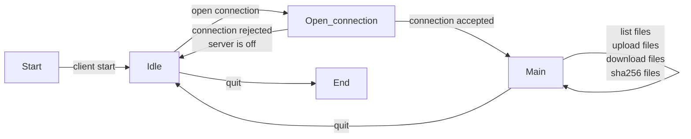
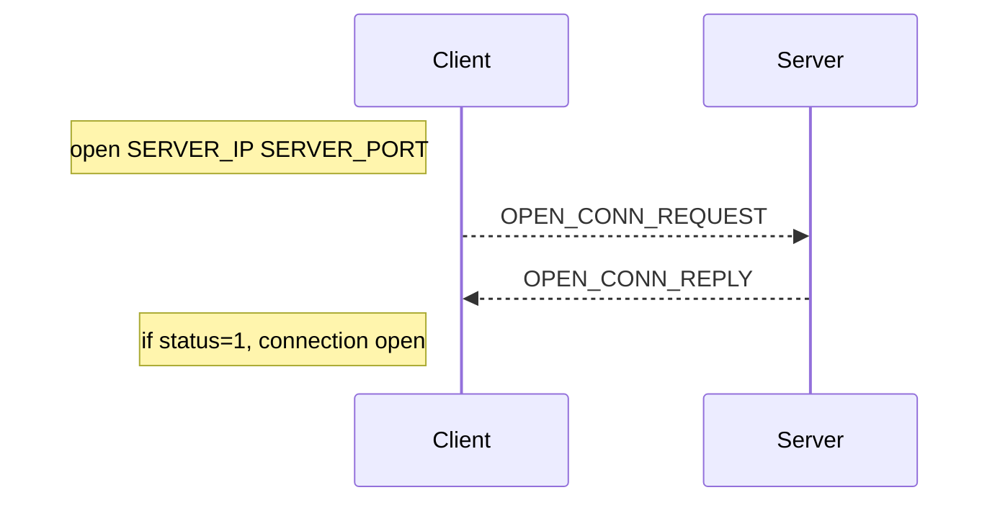
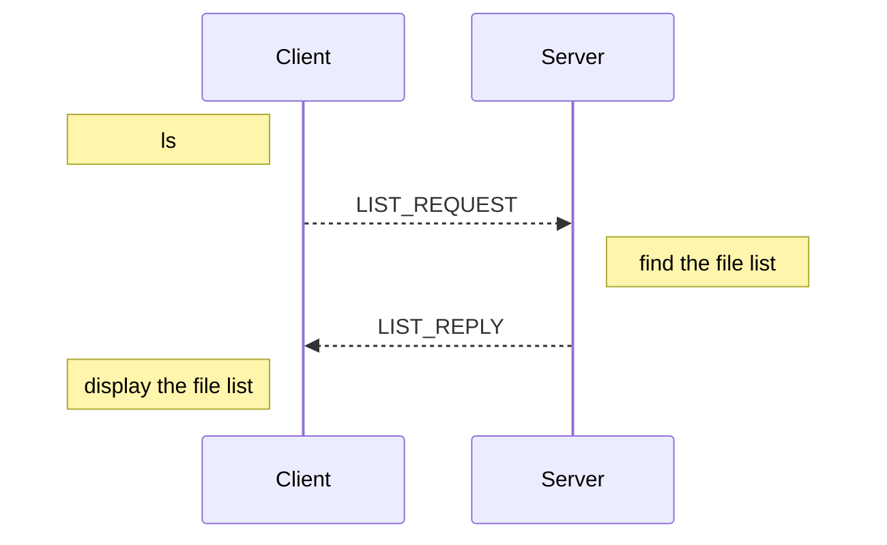
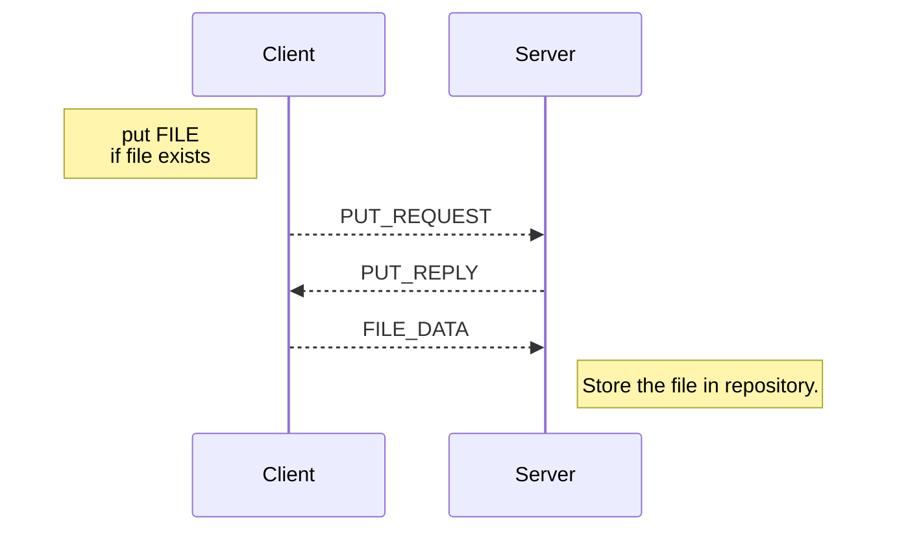
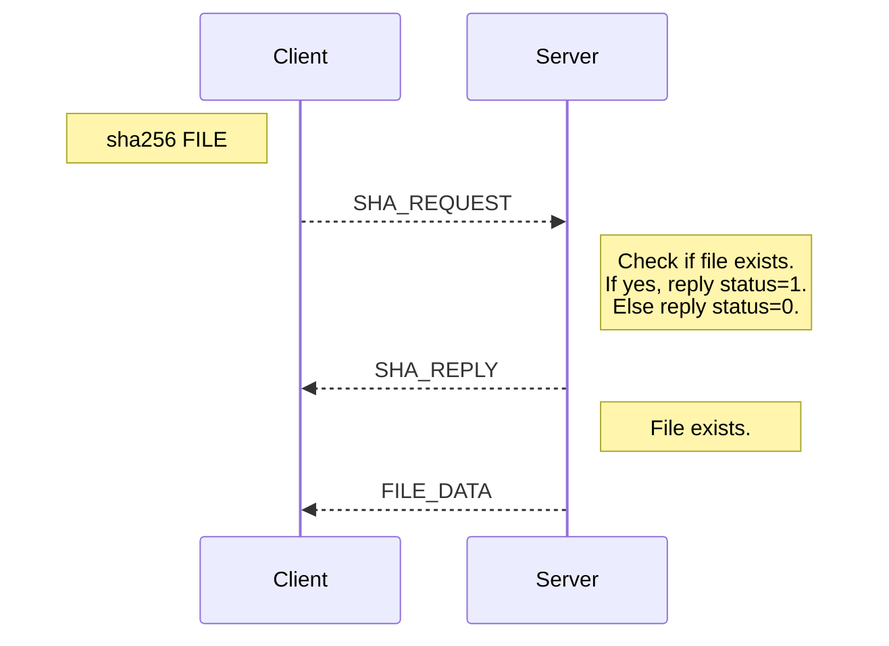
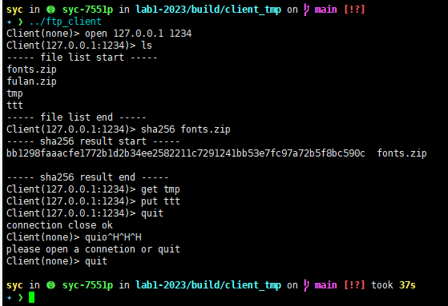

# myFTP 协议

> 请从[北大教学网](https://course.pku.edu.cn)获取本 Lab 任务的 Github 邀请链接, DDL: `2023-10-31 23:30:00`

MyFTP 是我们为了方便同学们快速理解 POSIX API 设计的一个简单的 Lab

在这个 Lab 中你需要完成一个简单的 FTP Server 和 FTP Client CLI (CLI指命令行界面)

## 1. 实现要求

1. MyFTP 的 Client 支持以下的命令
    1. `open <IP> <port>`: 建立一个到 `<IP>:<port>` 的连接
    2. `ls`: 获取对方当前运行目录下的文件列表。
    3. `get <filename>`: 将 Server 运行目录中的 `<filename>` 文件存放到 Client 运行目录的 `<filename>` 中。
    4. `put <filename>`: 将 Client 运行目录中的 `<filename>` 文件存放到 Server 运行目录的 `<filename>` 中。
    5. `sha256 <filename>`：在 Server 运行目录中查询某个文件的 sha256 值，若不存在则返回不存在。
    6. `quit`: 如有连接则断开连接，回到 `open` 前的状态；如果已经是 `open` 前的状态，则关闭 Client。
2. MyFTP的Server需要支持如下的功能特点
    1. 获取文件列表。这里文件列表由指令 `ls` 生成，可以使用 `popen` 或者 `pipe+fork+execv` 的手段获取其他进程的输出结果。
    2. 下载文件。
    3. 上传文件。
    4. 支持 sha256 查询。这里校验和结果由指令 `sha256sum FILE` 生成，可以使用 `popen` 或者 `pipe+fork+execv` 的手段获取其他进程的输出结果。

### 1.1 Client的运行

基于“3. 如何进行本地测试”一节的描述，编译完成后，期望在 build 目录下生成可执行程序 `ftp_client`，你可以通过在 build 目录中直接执行 `./ftp_client` 启动 Client。  
实际测试时我们会通过在任意目录中使用 `ftp_client` 的绝对路径，在没有任何参数的情况下执行 `ftp_client`。

### 1.2 Server的运行

基于“3. 如何进行本地测试”一节的描述，编译完成后，期望在 build 目录下生成可执行程序 `ftp_server`，你可以通过在 build 目录中直接执行 `./ftp_server 127.0.0.1 12323` 启动 Server (该 Server 监听 127.0.0.1:12323)。  
实际测试时我们会通过在任意目录中使用 `ftp_server` 的绝对路径，以参数 IP 和 Port 启动 `ftp_server` 分别作为 Server 需要监听的 IP 和端口。

> 关于绝对路径和启动目录的说明  
> 假设我们的 `ftp_server` 可执行文件在 `/root/ftp/build/ftp_server` 目录下  
> 我们使用终端切换到目录 `/root/tmp` 目录下，`cd /root/tmp`  
> 然后使用绝对路径执行程序 `/root/ftp/build/ftp_server 127.0.0.1 20729`  
> 此时该指令就在 `/root/tmp` 目录下启动了 `ftp_server`

## 2. 技术规范

### 2.1 数据报文格式

``` cpp
struct {
    byte m_protocol[MAGIC_NUMBER_LENGTH]; /* protocol magic number (6 bytes) */
    type m_type;                          /* type (1 byte) */
    status m_status;                      /* status (1 byte) */
    uint32_t m_length;                    /* length (4 bytes) in Big endian*/
} __attribute__ ((packed));
```

注意我们添加`__attribute__ ((packed))`以避免数据结构对齐产生的问题

Client 和 Server 将交换协议信息，以执行各项功能。所有协议消息前面都有代码所示的协议头，基于 TCP 协议进行通信。  
即每一个 802.3 网络上的报文都有如下的形式:

```plain
|802.3 Header|IP Header|TCP Header|myFTP Header|myFTP Data|
```

其中 TCP Header 以及之前的头会由系统生成, 我们要实现的是一个应用层协议，也就是 myFTP Header 以及以后的内容。  

### 2.2 myFTP Header格式

文档中所称的请求为从 Client 发送给 Server 的报文，回复为从 Server 发送给 Client 的报文。  
对于所有的报文，myFTP Header 中的 `m_protocol` 字段的值都应当为 `"\xc1\xa1\x10ftp"` (即三个字符 '\xc1\xa1\x10' 后接字符串 "ftp" 共 6bytes)，我们通过这个字段来辨识是否为正确的协议版本即 myFTP 协议。  
`m_type` 字段标识了当前报文的类型，具体取值见 2.3。  
`m_status` 只会为 0 或者 1, Server 用该选项通知客户端当前状态，具体取值见 2.3。  
报文的长度 `m_length` 为**大端法**表示，长度包括包头和数据的**总长度**, 你可以认为在任何时候报文的长度不会超过 `limits.h` 中定义的 `INT_MAX` 。

### 2.3 功能描述



上图描述了 Client 的状态机, Server 对于每一个 Client, 以及 Client 自身都应当维护这样一个简单的状态机。  
Client 在每一个时刻只能执行一个请求, 只有当一个请求执行完成后才能开始下一个。

#### 2.3.1 Open a Connection

Client 和 Server 会按照如下的步骤进行交互:

1. 当用户启动 Client 并输入以下命令时 `open SERVER_IP SERVER_PORT` (其中 `SERVER IP` 和 `SERVER_PORT` 分别是 Server 的 IP 地址和端口号)，那么一个 TCP 连接应该被连接到 Server 的 IP 地址和端口。
2. 接下来，Client 将向 Server 发送一个协议消息 `OPEN_CONN_REQUEST` ，请求打开一个连接。
3. 如果 Server 正在运行（即它正在监听 Server 的端口号），它将回复一个 `OPEN_CONN_REPLY` 类型的协议消息。
4. 最后 Client 收到 Server 的回复。



报文格式如下：

```c
// OPEN_CONN_REQUEST
struct {
    type = 0xA1
    status = unused
    length = 12
}
// OPEN_CONN_REPLY
struct {
    type = 0xA2
    status = 1
    length = 12
}
```

请注意：

1. 当 Server 启动时，他的 `OPEN_CONN_REQUEST` 类型的回复的 `m_status=1`
2. 当一个字段被说明为未使用时，无论是 Server 还是 Client 都不会读取该字段内容。

#### 2.3.2 List Files

用户在连接成功后，就可以执行主要功能。假设用户想列出存储在 Server 中的所有文件。用户将发出一个命令`ls`。然后，Client 将向 Server 发送一个协议消息，类型为 `LIST_REQUEST`。Server 将回复一个协议消息`LIST_REPLY` 以及可用文件的列表。  
所有文件都存储程序的工作目录中（注意工作目录不等价于可执行程序位置，而是从何处启动了该程序，上面有说明）。下面列出了对资源库目录的假设：

1. 该目录在 Server 启动前已被创建。
2. 当 Server 启动时，该目录可能包含文件。
3. 该目录只包含常规文件（即没有子目录，没有链接文件等等）。
4. Server 进程有必要的权限来访问该目录以及该目录内的文件。
5. 文件只包含一下一组字符：字母（a-z和A-Z）和数字（0-9）。
6. 在该目录下执行 `ls` 指令，其返回的结果的总长度不会超过 2047 个字符

要在Server端读取目录，你可以使用`popen`获取Linux中`ls`程序执行的返回结果，并将其结果返回，注意返回的内容结尾应当增加一个`\0`以表示内容结束。



报文格式：

```c
// LIST_REQUEST
struct {
    type = 0xA3
    status = unused
    length = 12
}
// LIST_REPLY
struct {
    type = 0xA4
    status = unused
    length = 12 + strlen(payload) + 1
    payload = file names, as one null-terminated string
}
```

#### 2.3.3 Download Files

假设用户想从 Server 上下载一个文件，然后他发出了一个命令 `get FILE` , 其中 `FILE` 是要下载的文件的名称。  
然后，Client 将向 Server 发送一个协议消息 `GET_REQUEST`。Server 将首先检查该文件在其资源库目录中是否可用。  
如果文件不存在，Server 将回复一个协议消息 `GET_REPLY`，`m_status` 设置为 0。  
如果文件存在，Server 将回复一个协议消息 `GET_REPLY`，`m_status` 设置为 1。  
以及一个包含文件内容的 `FILE_DATA` 消息。  

请注意，一个文件可以是 ASCII 或二进制模式。你应该确保 ASCII 和二进制文件都被支持。此外，该程序将覆盖现有的本地文件。  
在这里，我们假设对于每个 Client，在用户发出下一个命令之前，一次只下载一个文件。下图展示了如何下载文件的消息流。


报文格式：

```c
// GET_REQUEST
struct {
    type = 0xA5
    status = unused
    length = 12 + strlen(payload) + 1
    payload = one file name, in one null-terminated string
}
// GET_REPLY
struct {
    type = 0xA6
    status = 0 or 1
    length = 12
}
// FILE_DATA
struct {
    type = 0xFF
    status = unused
    length = 12 + file size
    payload = file payload
}
```

#### 2.3.4 Upload Files

假设用户想上传一个文件到 Server。然后，他发出一个命令 `put FILE` ,其中 `FILE` 是要上传的文件的名称。  
首先，Client 将检查该文件是否存在于本地（即在 Client）。如果不存在，Client 将显示一个错误消息，说明该文件不存在。  
如果文件在本地存在，那么 Client 将向 Server 发送一个协议消息 `PUT_REQUEST`。  
Server将回复一个协议消息 `PUT_REPLY` 并等待文件。然后，Client 将发送一个包含文件内容和`FILE_DATA` 消息。

这里，我们假设上传的文件与 Client 程序驻留在同一目录下。  
另外，在用户发出下一个命令之前，每次只上传一个文件。  
最后，Server 将上传的文件存储在其工作目录下，使用用户提供的名称。  
注意，Server 可能会覆盖现有的文件。  
同样，所有文件可以是 ASCII 码，也可以是二进制。你应该确保二进制文件被支持。  
下图显示了如何上传一个文件的消息流。



报文格式：

```c
// PUT_REQUEST
struct {
    type = 0xA7
    status = unused
    length = 12 + strlen(payload) + 1
    payload = one file name, in one null-terminated string
}
// PUT_REPLY
struct {
    type = 0xA8
    status = unused
    length = 12
}
// FILE_DATA
struct {
    type = 0xFF
    status = unused
    length = 12 + file size
    payload = file payload
}
```

#### 2.3.5 Calculate the checksum

文件在传输的过程中可能发生错误，我们可以利用校验码来检查传输结果是否正常。

假设用户想查询 Server 上目录下某个文件的 sha256 校验值，他发出一个命令 `sha256 FILE`，其中 `FILE` 是想要查询校验码的文件名称。  
然后，Client 将向 Server 发送一个协议消息 `SHA_REQUEST`。Server 将首先检查该文件在其资源库目录中是否可用。  
如果文件不存在，Server 将回复一个协议消息 `SHA_REPLY`，`m_status` 设置为 0。
如果文件存在，Server 将回复一个协议消息 `SHA_REPLY`，`m_status` 设置为 1。
以及一个包含关于需要查询的文件的 sha256 校验码的 `FILE_DATA` 消息。  
如果文件存在，Client 需要将接收到的 sha256 校验码输出到屏幕。  
类似 ls 命令，要在 Server 端计算 sha256 校验码，你可以使用`popen`获取 Linux 中`sha256sum FILE` 程序执行的返回结果（其中 `FILE` 为需要查询的文件名），并将其结果返回，注意返回的内容结尾应当增加一个`\0`以表示内容结束。
下面是计算校验码的消息流。



报文格式：

```c
// SHA_REQUEST
struct {
    type = 0xA9
    status = unused
    length = 12 + strlen(payload) + 1
    payload = one file name, in one null-terminated string
}
// SHA_REPLY
struct {
    type = 0xAA
    status = 0 or 1
    length = 12
}
// FILE_DATA
struct {
    type = 0xFF
    status = unused
    length = 12 + strlen(payload) + 1
    payload = sha256 checksum, in one null-terminated string
}
```

#### 2.3.6 Close Connection

为了关闭连接，用户发出 `quit` 的命令。
Client 将向 Server 发送一个协议消息 `QUIT_REQUEST`。
Server 将回复一个协议消息 `QUIT_REPLY` 给 Client ，而 Client 应该释放连接（即关闭 TCP 连接）。此时进入状态机的 Idle 状态。  
再次输入 quit 命令，Client 程序将退出。

```c
// QUIT_REQUEST
struct {
    type = 0xAB
    status = unused
    length = 12
}
// QUIT_REPLY
struct {
    type = 0xAC
    status = unused
    length = 12
}
```

### 2.4 一个Client的Example

下图给出了一个执行Client的Example，你可以设计其他更炫的输出的Client，但是请注意，输入将从`STDIN`输入。



### 2.5 关于报文格式的总的说明

下表对所有的报文格式作了一个汇总

|名称|type|status|length|payload|
|--|--|--|--|--|
|OPEN_CONN_REQUEST|0xA1|/|12|/|
|OPEN_CONN_REPLY|0xA2|1|12|/|
|LIST_REQUEST|0xA3|/|12|/|
|LIST_REPLY|0xA4|/|12 + strlen(payload) + 1|file names, as one null-terminated string|
|GET_REQUEST|0xA5|/|12 + strlen(payload) + 1|one file name, in one null-terminated string|
|GET_REPLY|0xA6|0 or 1|12|/|
|FILE_DATA|0xFF|/|12 + file size|file payload|
|PUT_REQUEST|0xA7|/|12 + strlen(payload) + 1|one file name, in one null-terminated string|
|PUT_REPLY|0xA8|/|12|/|
|SHA_REQUEST|0xA9|/|12 + strlen(payload) + 1|one file name, in one null-terminated string|
|SHA_REPLY|0xAA|0 or 1|12|/|
|QUIT_REQUEST|0xAB|/|12|/|
|QUIT_REPLY|0xAC|/|12|/|

## 3. 如何进行本地测试

我们已经提供了自动评测的程序，在接受 Github Classroom 邀请后每位同学有独立的 Github 仓库。  
如果无法进行正常测试，请和助教联系。

### 3.1 获取仓库

1. 从远程仓库 clone
2. 在根目录中执行`git submodule update --init`
3. 在根目录中执行`git submodule update --remote`

### 3.2 编译 myFTP 程序

在根目录中执行 `mkdir build && cd build && cmake .. && make -j`  
我们期望此时在 `build` 目录下应该有两个可执行文件 `ftp_server` 和 `ftp_client` 分别是你编写的 Server 和 Client 程序。

### 3.3 编译测试程序

我们提供了本地化的测试程序，如果需要在本地进行测试，请参考下述步骤。  

1. 如果你在上面的获取仓库一节成功执行了 `git submodule update --remote` 命令，此时你的项目根目录下应该有文件夹 `test_local`。  
2. 进入该文件夹内，你应该能看到 `ftp_client_std` 和 `ftp_server_std` 两个程序分别是标准的 Server 和 Client 程序。
3. 在 `test_local` 文件内执行 `mkdir build && cd build && cmake .. && make -j`，开始编译自动测试程序。  
4. 编译完成后，你应该能在 `test_local/build` 目录下看到可执行文件 `ftp_test`。  
5. 将 `test_local/ftp_client_std`, `test_local/ftp_server_std` 和 `test_local/build/ftp_test` 三个程序拷贝到你在上一节编译 `myFTP` 得到 `ftp_client` 和 `ftp_server` 两个可执行文件的 `build` 目录下。  

将上述步骤均完成后，一个供参考的文件目录示意图如下：

```plain
CMakeLists.txt
ftp_server.cpp
ftp_client.cpp
build/
      ftp_server
      ftp_client
      ftp_server_std
      ftp_client_std
      ftp_test
      （其它文件）
testlocal/
          CMakeLists.txt
          ftp_server_std
          ftp_client_std
          test.cpp
          build/
                ftp_test
                （其他文件）
          （其它文件）
（其它文件）
```

注意若自动测试程序发生更新则需要执行如下指令获取最新的测试程序（我们会在教学网和微信群进行通知）:  
在根目录中执行 `git submodule update --remote`，并重新执行上述步骤 3, 4, 5 即可  

### 3.4 本地测试

在 build 目录中执行`./ftp_test`即可进行测试

要求:

1. Server 可执行程序和 Client 可执行程序名称需要严格按照 `ftp_server` 和 `ftp_client` 命名 (在下发的模板中我们已经完成了这一段代码)你只需要将对应的源文件添加到 CMake 中对应的 target 上即可
2. 具体协议内容请参考技术规范一节实现,在进行某一项测试的时候,只有一侧会使用你的 Server/Client ,另一侧为标准程序,为了确保能够正常通信,我们希望你的代码能够和标准程序进行交互
3. 任何对提供的**二进制文件**的修改均被视为作弊行为, 一经发现该Lab将被记为0分

### 3.5 提交

在根目录中执行如下指令提交所有文件

``` bash
git add .
git commit -am "Update"
git push
```

DDL 前最后一次提交视为最终版本

## 4. 分数计算

本次 Lab 总分 120 分

部分测试点在 Deadline 前放出，另一部分测试点会在 Deadline 后统一进行测试，但是我们会在数据点内容中详细描述所有测试点的数据的特点。  
同学们可以通过将该仓库 push 到 Github 进行自动化测试（Deadline 前只会看到满分为 80 分）。

以下的表格给出了每一个测试点对应的ID和内容，你可以通过 `.\ftp_test --gtest_filter=ID` 来只针对某个测试点执行测试

或者使用通配符如`.\ftp_test --gtest_filter="FTPServer.*"`只针对 Server 进行测试

每一个测试点名由`${类别}.${测试点名称}`构成

如没有特殊说明,则每一个测试点同时只有一个 Client

<table>
    <tr>
        <td>类别</td>
        <td>测试点名称</td>
        <td>测试内容</td>
        <td>分数占比</td>
        <td>是否Deadline前放出</td>
        <td>数据点内容</td>
    </tr>
    <tr>
        <td rowspan="7">FTPServer</td>
        <td>Open</td>
        <td>测试OPEN_REQUEST</td>
        <td>10</td>
        <td>是</td>
        <td>收到正确的OPEN_REQUEST请求</td>
    </tr>
    <tr>
        <td>Get</td>
        <td>测试GET_REQUEST</td>
        <td>10</td>
        <td>是</td>
        <td>获取大小为3bytes的，文件名长度不超过3bytess的文件，文件名和内容随机生成</td>
    </tr>
    <tr>
        <td>Put</td>
        <td>测试PUT_REQUEST</td>
        <td>10</td>
        <td>是</td>
        <td>上传大小为3bytes的，文件名长度不超过3bytes的文件，文件名和内容随机生成</td>
    </tr>
    <tr>
        <td>List</td>
        <td>测试LIST_REQUEST</td>
        <td>10</td>
        <td>是</td>
        <td>获取文件夹内所有的文件列表</td>
    </tr>
    <tr>
        <td>SHA256</td>
        <td>测试SHA_REQUEST</td>
        <td>10</td>
        <td>是</td>
        <td>获取文件的 sha256 校验码</td>
    </tr>
    <tr>
        <td>GetBig</td>
        <td>测试GET_REQUEST</td>
        <td>10</td>
        <td>否</td>
        <td>获取大小为1MB的，文件名为8bytes的文件，文件名和内容随机生成</td>
    </tr>
    <tr>
        <td>PutBig</td>
        <td>测试PUT_REQUEST</td>
        <td>10</td>
        <td>否</td>
        <td>上传大小为1MB的，文件名为8bytes的文件，文件名和内容随机生成</td>
    </tr>
    <tr>
        <td rowspan="5">FTPClient</td>
        <td>Open</td>
        <td>测试OPEN_REQUEST</td>
        <td>10</td>
        <td>是</td>
        <td>成功和Server建立连接</td>
    </tr>
    <tr>
        <td>Get</td>
        <td>测试GET_REQUEST</td>
        <td>10</td>
        <td>是</td>
        <td>获取大小为3bytes的，文件名长度不超过3bytes的文件，该文件名和内容随机生成</td>
    </tr>
    <tr>
        <td>Put</td>
        <td>测试PUT_REQUEST</td>
        <td>10</td>
        <td>是</td>
        <td>上传大小为3bytes的，文件名长度不超过3bytes的文件，该文件名和内容随机生成</td>
    </tr>
    <tr>
        <td>GetBig</td>
        <td>测试GET_REQUEST</td>
        <td>10</td>
        <td>否</td>
        <td>获取大小为1MB的，文件名为8bytes的文件，文件名和内容随机生成</td>
    </tr>
    <tr>
        <td>PutBig</td>
        <td>测试PUT_REQUEST</td>
        <td>10</td>
        <td>否</td>
        <td>上传大小为1MB的，文件名为8bytes的文件，文件名和内容随机生成</td>
    </tr>
</table>

## 5. 其他问题

> 文件名无空格等特殊符号，仅包含数字和字母  
> 若无法执行 xxx_std 则请通过 `chmod +x xxx_std` 为该文件增加可执行权限  
> 同学们 push 的时候并不会将 build 目录 push 上去，可执行文件会在上传之后从代码自动生成，不需要做其他操作，无需考虑可执行权限问题
